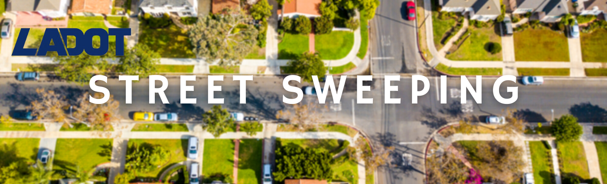

# LADOT COVID19 Enforcement
## Goals
Using parking citation data, social media data, and city council records the aim of this project is to analyze the City of Los Angeles' transition plan to resume street sweeper services on 10/15/2020.

1. Use NLP techniques to analyze the intent of documents from City Council and the Department of Transportation.
2. Analyze the effectiveness of "public outreach" efforts using social media, news articles, and historical citation data.
3. Use Street Sweeping Citation data to determine the impact of "public outreach" efforts.
4. Recommend ways for LADOT to improve their outreach efforts.

## Background

### Declaration of Local Emergency
> "On March 4, 2020, the Mayor [of Los Angeles] declared a local emergency in response to the COVID-19 pandemic. On March 6, the City Council approved a resolution ratifying the Declaration of Local Emergency. With the Declaration of a Local Emergency and the unique public health risks posed by COVID-19, on __March 16__, the Mayor relaxed parking enforcement across the City putting a temporary halt to the issuance of several citations so that residents can more effectively practice the safe social distancing necessary during the outbreak. Subsequently, LADOT relaxed enforcement for the following categories: 
> - __Residential street sweeping__
> - Expired registration on a vehicle
> - Peak/rush hour and anti-gridlock zone parking restrictions
> - Vehicles displaying recently expired permits within preferential parking districts were granted a two-week grace period following the expiration
> - No ticket or tow for abandoned vehicles, overnight parking, or oversize vehicles." - [Source](https://github.com/Promeos/LADOT-COVID19-enforcement/blob/main/city-documents/city-council/LADOT-transition-plan.pdf)

### Transition Plan
> "On September 1, 2020, City Council instructed LADOT to continue the current relaxed enforcement until October 1, 2020 and to report back with a phased transition plan to resume parking enforcement and propose economic relief measures for parking fines." - [Source](https://github.com/Promeos/LADOT-COVID19-enforcement/blob/main/city-documents/city-council/LADOT-transition-plan.pdf) 

### Public Outreach
__LADOT Press Release__ 
> "Per Council instruction, LADOT will conduct outreach to inform Angelenos on timing of resumed enforcement as well as financial assistance programs via social media and outreach to press". - [Source](https://github.com/Promeos/LADOT-COVID19-enforcement/blob/main/city-documents/LADOT/enforcement.pdf)

__Los Angeles City Council__ 
> Beginning October 15,2020, resume parking enforcement and impounds, when applicable, for street cleaning, abandoned vehicles, oversize and overnight restrictions, peak hour and anti-gridlock zones, and expired registration, __and conduct public outreach and education between October 1,2020 and October 14,2020__. - [Source](https://github.com/Promeos/LADOT-COVID19-enforcement/blob/main/city-documents/city-council/public-outreach-period.pdf)

## Deliverables
- [Tablaeu Map](https://public.tableau.com/profile/promeos#!/vizhome/LADOTCOVID19StreetSweeperCitations/enforcement-10152020?publish=yes)
- [MVP Notebook](https://github.com/Promeos/LADOT-COVID19-enforcement/blob/main/MVP.ipynb)
- [Final Notebook](https://github.com/Promeos/LADOT-COVID19-enforcement/blob/main/summary.ipynb)
- [Slide Presentation](https://www.canva.com/design/DAERUYKNmnQ/0g_1Ed6ynJUkhXlPImCR9w/view?utm_content=DAERUYKNmnQ&utm_campaign=designshare&utm_medium=link&utm_source=sharebutton)
- Video presentation

### Project Management
- [Trello Board](https://trello.com/b/A1KCGKQN/ladot-covid19-enforcement)

### Acknowledgments
This dataset is maintained using Socrata's API and Kaggle's API. Socrata has assisted countless organizations with hosting their open data and has been an integral part of the process of bringing more data to the public.  

## Data Dictionary
| Feature Name           | Description                                                                        |
|------------------------|------------------------------------------------------------------------------------|
| issue_date             | The citation date formatted as yyyy-mm-dd                                          |
| issue_time             | The citation time formatted as HH-MM-ss 24HRS                                      |
| rp_state_plate         | The state license plate i.e. CA, TX                                                |
| plate_expiry_date      | The date the license plates expire.yyyy-mm-dd date format                          |
| make                   | Indicates the car manufacturer ex. NISS is Nissan.                                 |
| body_style             | Indicates the body style of the car. PA is a Passenger vehicle with four doors.    |
| color                  | The color of the vehicle.                                                          |
| location               | The street name and number where the citation was issued.                          |
| route                  | Indicates the route that issued the citation                                       |
| agency                 | The issuing agency. See city-documents/LADOT/agency-names.pdf                      |
| violtion_code          | The Alpha-numeric code used to indicate the type of violation.                     |
| violation_description  | Short description of the parking citation.                                         |
| fine_amount            | The citation fee in USD.                                                           |
| latitude               | Latitude of the citation location.                                                 |
| longitude              | Longitude of the citaiton location.                                                |
| day_of_week            | The day of the week the citation was issued.                                       |
| issue_year             | The citation year.                                                                 |
| issue_hour             | The citation hour- 24HR format                                                     |
| issue_minute           | The citation minute.                                                               |

**City Documents**
Access the Los Angeles City Council documents [here](https://cityclerk.lacity.org/lacityclerkconnect/index.cfm?fa=ccfi.viewrecord&cfnumber=20-1365).

## Initial Thoughts
- Why did street sweeping services resume?
- What was the city's public outreach? Was it effective?
- How did residents react?
- Which streets and neighborhoods were effected the most?
- How can LADOT improve their outreach methods moving forward?

## Project Steps
### Acquire
Download the dataset [here](https://www.kaggle.com/cityofLA/los-angeles-parking-citations/discussion). The data is stored in a file named `parking-citations.csv`. The file contains approximately 7 years worth of parking citations issued in Los Angeles, California.

[Placeholder: Web Scraping]

### Prepare
**Missing Values**
- Dropped rows missing latitude and longitude data. 99999.0 indicates null.
- Dropped rows missing license plate expiration date.
- Dropped columns: vin, marked_time, color_description, body_style_description, agency_description, meter_id, ticker_number
- Dropped rows with missing values.

**Data Type Casting, Metric Conversion, and Formatting**
- Converted all numeric date columns to datetime.
- Converted issue_time from a float to TimeStamp.
- Converted agency from a float to an integer.
- Converted latitude amd longitude values from US Feet coordinates \[NAD1983StatePlaneCaliforniaVFIPS0405_Feet projection] to standard coordinates.
  - Used folium and pyproj library to convert the coordinates.
- Removed capitalization and spacing from column names.
  
**Feature Engineering**
- Created a new column called `day_of_week`.
- Created a new column called `issue_year`.
- Created a new column called `issue_hour`.
- Created a new column called `issue_minute`.

[Placeholder: Prep Web Scraped Data]

### Explore
Parking Citations
[Map of citations]

#### Hypotheses
1. Fines collected from 10/15/2020 - 11/15/2020 significantly greater than average?
2. Was the public's sentiment of LADOT's enforcement on 10/15/2020 negative?
3. Public outreach efforts were ineffective.

Text data
[Newspapers: City Council, LADOT]
[Twitter: City Council, LADOT]
[Sentiment Analysis]
[Word Clouds]

### Conclusions

## How to Reproduce
### Tools & Requirements
- pyproj
> `pip install pyproj`
- folium
> `pip install folium`

All files are reproducible and available for download and use.
- [x] Read this README.md
- [ ] Clone this repository
- [ ] Acquire the dataset from [Kaggle](https://www.kaggle.com/cityofLA/los-angeles-parking-citations?select=LADOT-Xerox+Crib+Sheet+Agency+Codes+12-31-2015+%281%29.pdf).
- [ ] Run Summary.ipynb
